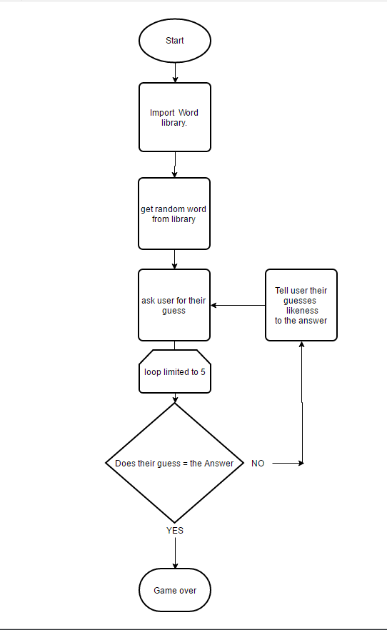

'''
import random_word_library                                                              #maximum of 7 letters long in library

Game = False
number_of_guesses = 5
Answer = get random from (random_word_libaray)                                      #picks a word at random and assigns to variable
Word_Length = find length of string(Answer)                                            #counts length of string and assigns to variable

while Game = False and number_of_guesses < 1:                                          #loops untill 5 guesses or correct guess
    print("Im thinking of a word with", Word_Length, "letters\, can you guess it?")
    print(" You have", number_of_guesses, "left.")
    number_of_guesses = number_of_guesses - 1                                                                       
    Guess = input()
    correct_letters = likeness of Guess to Answer                                       #letters have to be in same position to be alike.
       if correct_letters = Word_Length:                                              
          print("Congrats, you did it in", number_of_guesses, "guesses!")
           Game = True
       
       else:                                                                            #if the word is not correct this will run
           print("Your guess had", correct_letters, "in the right place")               #tells you likeness of your guess to the answer

print ("Your word was", Answer)           
print ("Game Over")       
'''     

